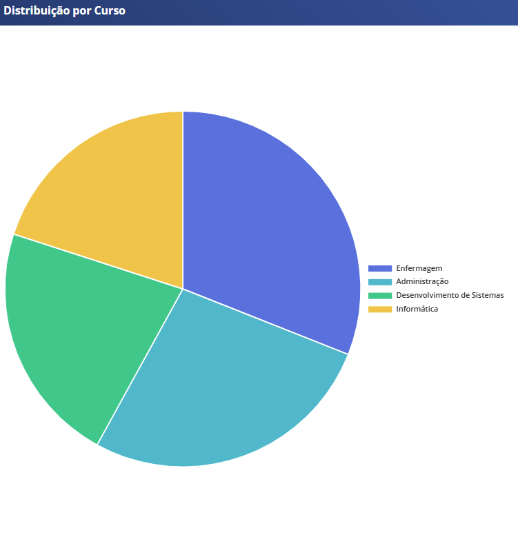
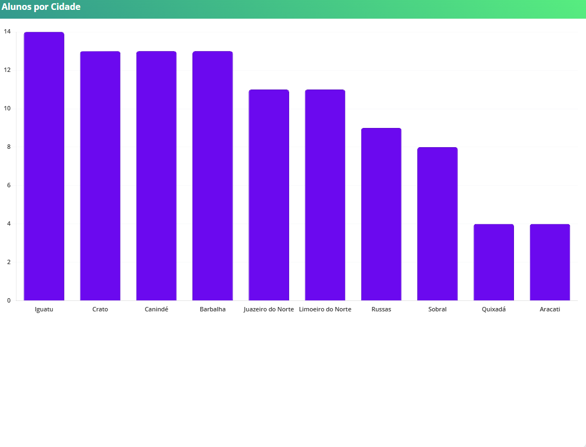
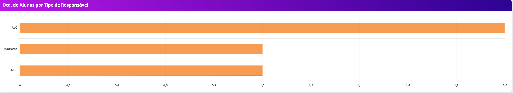
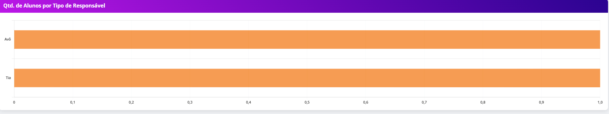
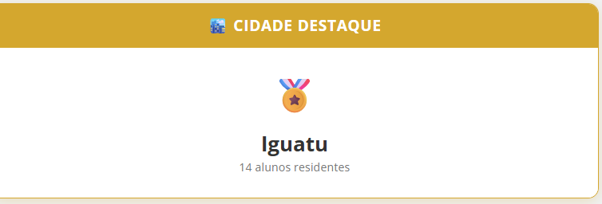
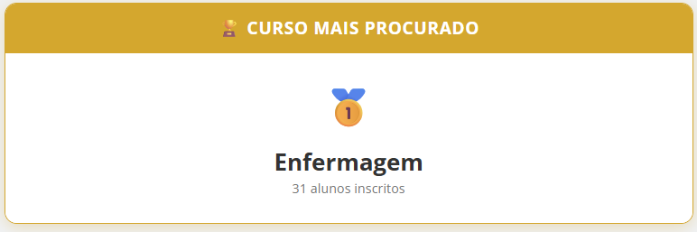
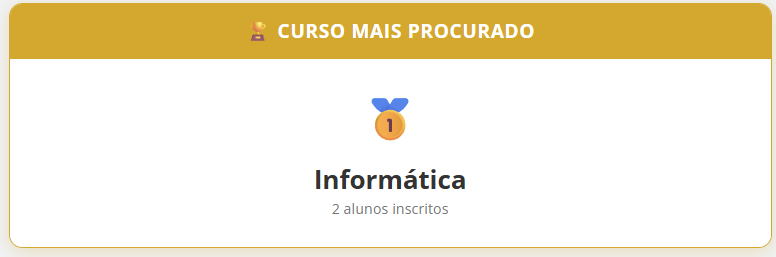

# Trabalho_php
Trabalho da disciplina de Banco de Dados
# 📚 Sistema de Matrículas Acadêmicas

Este repositório contém o código-fonte, scripts SQL e documentação do projeto Sistema de Matrículas Acadêmicas, desenvolvido para otimizar e automatizar o processo de registro e gerenciamento de estudantes em uma instituição de ensino.

# 🌟 Introdução ao Sistema

O Sistema de Matrículas é uma solução robusta projetada para gerenciar eficientemente o ciclo de vida da matrícula, desde a inscrição inicial até o registro nas disciplinas e a manutenção dos dados cadastrais do aluno.

Visão Geral da Interface

Aqui está uma prévia de algumas telas principais do sistema, mostrando a interface e a usabilidade.

1. Tela Inicial e Dashboard

[home.php](./home.png)
Descrição: Tela inicial contendo o Dashboard, cards e filtros, permitindo o trabalho com os dados sem o usuario possuir o conhecimento de SQL.

2. Tela de Cadastro de Alunos

[telacadastro](./cadastro.png)
Descrição: Formulário para inclusão de dados pessoais dos estudantes.

3. Tela de Listagem de Alunos

[telalista](./listar.png)

# 💾 Scripts SQL e Banco de Dados

1. Codigos do Banco de Dados

O sistema utiliza um banco de dados relacional. Abaixo está o código SQL completo para a criação das tabelas.

'''CREATE TABLE users (
    user_id INT AUTO_INCREMENT PRIMARY KEY,
    user_name VARCHAR(100) NOT NULL,
    user_email VARCHAR(150) NOT NULL UNIQUE,
    user_password VARCHAR(255) NOT NULL
);'''

'''CREATE TABLE alunos (
    id INT AUTO_INCREMENT PRIMARY KEY,
    nome VARCHAR(255) NOT NULL,
    data_nascimento DATE NOT NULL,
    cidade VARCHAR(100),
    rua VARCHAR(255),
    bairro VARCHAR(100),
    numero VARCHAR(20),
    cep VARCHAR(10),
    nome_responsavel VARCHAR(255),
    tipo_responsavel VARCHAR(50),
    curso VARCHAR(100) NOT NULL,
    data_cadastro TIMESTAMP DEFAULT CURRENT_TIMESTAMP
);'''

# 📊 Consultas e Relatórios (Dashboard)

Para facilitar a tomada de decisão e o acompanhamento dos dados, o sistema conta com um Dashboard alimentado por consultas SQL estratégicas. Abaixo estão alguns gráficos gerados e a explicação de cada métrica analisada.

# 📊 Consultas e Relatórios (Dashboard)

Para facilitar a tomada de decisão e o acompanhamento dos dados, o sistema conta com um Dashboard alimentado por 10 consultas SQL estratégicas. Abaixo estão os gráficos gerados e a explicação de cada métrica analisada.

### 1. Total de Alunos por Curso

**Descrição:** Esta consulta agrupa os alunos com base na coluna `curso`, permitindo visualizar quais cursos possuem maior demanda e quais turmas estão mais vazias.

### 2. Distribuição Geográfica (Por Cidade)

**Descrição:** Análise baseada no campo `cidade`. Este gráfico ajuda a entender a origem dos estudantes, facilitando o planejamento de transporte ou logística escolar.

### 3. Alunos de Cursos Específicos por Cidade Específica
*(Sem representação gráfica)*
**Descrição:** Um detalhamento mais profundo da localização, focando em especificar a região de alunos de um mesmo curso. Identifica concentrações de alunos de determinada área de estudo em cidades específicas.

### 4. Tipos de Responsáveis

**Descrição:** Gráfico baseado na coluna `tipo_responsavel` (ex: Pai, Mãe, Avô/Avó), traçando o perfil demográfico dos tutores legais dos estudantes.

### 5. Total de Alunos por Tipo de Responsáveis (Juazeiro do Norte)

**Descrição:** Uma segmentação da consulta anterior, filtrando apenas os alunos residentes em **Juazeiro do Norte**. Permite comparar se o perfil familiar nesta cidade difere da média geral.

### 6. Total de Alunos por Tipo de Responsáveis (Canindé)

**Descrição:** Similar à anterior, porém aplicando o filtro para a cidade de **Canindé**. Essencial para análises regionais comparativas sobre os responsáveis legais.

### 7. Cidade Destaque

**Descrição:** Consulta que identifica e exibe a cidade com a maior concentração absoluta de alunos matriculados no sistema, destacando o principal polo de origem dos estudantes.

### 8. Cidade Destaque por Curso (Administração)

**Descrição:** Focada no curso de **Administração**, esta consulta revela qual cidade envia o maior número de alunos para esta graduação específica.

### 9. Curso Destaque

**Descrição:** Apresenta o curso com o maior número total de matrículas ativas no banco de dados, indicando a "carro-chefe" da instituição.

### 10. Curso Mais Procurado por Alunos de Crateús

**Descrição:** Uma análise cruzada que filtra os alunos residentes em **Crateús** para descobrir qual é o curso de maior preferência ou demanda dentro deste município específico.

---

# 🏁 Conclusão

O **Sistema de Matrículas Acadêmicas** cumpre seu objetivo de ser uma ferramenta prática e eficiente para a gestão escolar. A utilização da linguagem **PHP** integrada ao **MySQL** garantiu uma manipulação de dados rápida e segura, enquanto o **Bootstrap** proporcionou uma interface amigável e responsiva.

Este projeto permitiu aplicar conceitos fundamentais de:
* **CRUD** (Create, Read, Update, Delete);
* **Modelagem de Banco de Dados Relacional**;
* **Consultas SQL Avançadas** para geração de relatórios;
* **Front-end Responsivo** para melhor experiência do usuário.

Como próximos passos para evolução do sistema, planeja-se a implementação de níveis de acesso (Admin/Usuário), validação mais rigorosa de formulários e a migração para uma arquitetura MVC.

---
**Desenvolvido por Fabricio Eduardo**

